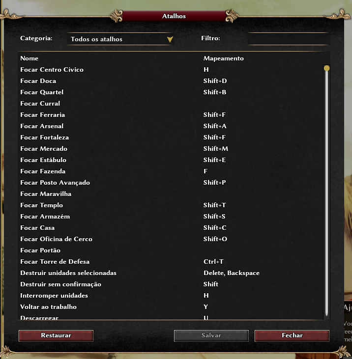

# Buildings Focus Extra Hotkeys

`buildings_focus_extra_hotkeys` is a GUI-only mod for 0 A.D. Release 28
(Boiorix). It adds configurable hotkeys that select and focus the local
player's main completed building of each supported type.

The mod does not change the simulation, issue network commands, or modify the
original 0 A.D. files. Camera movement and selection are local interface
operations.

## Supported hotkeys

The following actions are available in the game's hotkey editor:

- Focus Civic Center
- Focus Dock
- Focus Barracks
- Focus Corral
- Focus Blacksmith
- Focus Arsenal
- Focus Fortress
- Focus Market
- Focus Stable
- Focus Farmstead
- Focus Outpost
- Focus Wonder
- Focus Temple
- Focus Storehouse
- Focus House
- Focus Siege Workshop
- Focus Gate
- Focus Defense Tower

The actions do not have default key bindings. Assign them from the in-game
hotkey configuration screen.

## In-game hotkey editor

The mod's building focus actions appear in the standard 0 A.D. hotkey editor:



*Building focus hotkeys displayed in the in-game configuration screen.*

## Requirements

- 0 A.D. Release 28 (Boiorix) or a compatible version.
- Git, if installing by cloning the repository.

## Download

From GitHub, use **Code → Download ZIP**, extract the archive, and use the
`buildings_focus_extra_hotkeys` directory inside it.

Alternatively, clone the repository:

```bash
git clone https://github.com/<YOUR-USERNAME>/buildings_focus_extra_hotkeys.git
cd buildings_focus_extra_hotkeys
```

Replace `<YOUR-USERNAME>` with the GitHub account that hosts this repository.

## Installation

Copy the `buildings_focus_extra_hotkeys` directory to the 0 A.D. user mods
directory.

On Linux:

```bash
cp -r buildings_focus_extra_hotkeys ~/.local/share/0ad/mods/
```

If 0 A.D. was installed through Flatpak, use this directory instead:

```bash
cp -r buildings_focus_extra_hotkeys ~/.var/app/com.play0ad.zeroad/data/0ad/mods/
```

On Windows, copy it to:

```text
%USERPROFILE%\Documents\My Games\0ad\mods\
```

On macOS, copy it to:

```text
~/Library/Application Support/0ad/mods/
```

Then open 0 A.D., go to **Settings → Mod Selection**, enable **Building focus
hotkeys**, save the configuration, and restart the game.

The mod can also be launched from a terminal on Linux:

```bash
0ad -mod=public -mod=buildings_focus_extra_hotkeys
```

## Localization

The mod includes Brazilian Portuguese translations in
`buildings_focus_extra_hotkeys/l10n/pt_BR.buildings_focus_extra_hotkeys.po`.
The complete translatable message catalog is available at
`buildings_focus_extra_hotkeys/l10n/buildings_focus_extra_hotkeys.pot`.
All other 0 A.D. locales are supported through the English fallback; a
translated `<locale>.buildings_focus_extra_hotkeys.po` file can be added for
any supported language without changing the mod code.

## License

This project is distributed under the GNU General Public License (GPL).

## Development note

This project was created entirely with the assistance of artificial
intelligence. The implementation, documentation, and supporting files were
produced through an AI-assisted development process.
